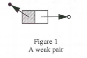
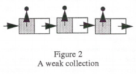
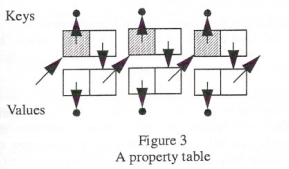
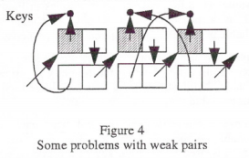

# Ephemerons:一种新的清理机制(Ephemerons:A New Finalization Mechanism)

----------

- 作者：Barry Hayes
- 译者：[重归混沌](http://blog.gotocoding.com)

## 摘要

*Finalization*发生在垃圾回收器通知应用程序一个对象“近似可回收”的时候。它被用来帮助应用程序维持不变性。为了使finalization更有用，这篇论文从一类叫做*ephemerons*的对象的角度定义了'近似可回收'。Ephemerons与weak pairs相似，但是一个在ephemeron的key字段中的对象可能会被归类为'近似可回收'， 即使它（这个key字段)从ephemeron中的value字段可达。

### 关键字

垃圾回收，Finalization，弱指针，资源管理

## 介绍

从早期的Lisp系统开始，带有垃圾回收的语言都有热情的追随者，并且至少从20世纪80年代早期[RAM84，Xer85]开始，*弱引用*的形式就已经出现在这些语言周围。弱引用允许回收器释放特定的对象，即使有一些记录指针指向他们，比如下面将会出现的对象缓存或属性关联。

当*finalization*功能被添加到回收器时，需要特定类型清理活动的对象将会在释放时受益。*finalization*仅需要在特定对象被回收时，回收器通知应用程序即可[Rov85,Par90]。

### 导读

在本论文中，我们首先讨论了垃圾回收,然后通过重点分析使用*finalization*管理外部资源来展开更详细的讨论。使用特定类型的*finalization*，涉及*不可复活*的回收器，我们提出一个问题，这些需要清理（finalization）的对象, 被他们自身的*finalization*所需要信息中的某些指针不恰当的持有。

这个问题的一个变种，与复活无关，随后在通过弱引用实现的*属性表*中演示。仅基于属性表的外部语义，简单的将一个对象与一个属性相关联就足以阻此它被回收。在垃圾回收社区这些问题都为人熟知，但是似乎并没有在什么著作中被讨论过。

最终，我们引入*ephemerons*作为weak pairs的一个变种, 一个使用弱引用的传统结构，并展示垃圾回收器如何跟踪*ephemerons*来解决存在的问题。一个能识别出*ephemeron*的垃圾回收器的实现伪码在论文的结尾给出。

为了对单处理器垃圾回收及自动内存管理有一个整体印象，可以查看Paul Wilson优秀的调查文章[Wil92]。为了对*finalization*进行有一个概念，可以查看[Hay92]。

### 声明

本文作者不是*ephemeron*的发明者。George Bosworth发明了*ephemerons*并且设计了本论文呈现的算法。

## 垃圾回收

动态垃圾回收语言避免了许多必须显式释放内存所产生的常见错误。在一些场景下，显式释放可能会更有效、清晰、简单，但是垃圾回收正在变得越来越普遍.

本文呈现的内容可以在引用计数垃圾回收器中被实现，但并不是非常容易。之后所有的讨论都将会假设垃圾回收器是跟踪回收器的一些变种，可能是分代垃圾回收器[FY69,LH83], 和保守垃圾回收器[BW88]。

一种观点，垃圾回收器的目的是提供关于对象如何相互连接的全局性信息。一般情况下，它被用来定位和释放从根对象不可达的一些特定的对象集合中的对象。

在垃圾回收器作为拓扑信息来源的观点中，很自然的询问提供的这些信息能够驱动些什么其他的服务。就简单的垃圾回收来说，这些信息也可以通过其他机制收集，比如引用计数[Col60,DB76]。本次讨论将会假设回收器是拓扑的惟一来源，目标是找到需要作为垃圾回收器需要相同类别的全局拓扑视图的其他服务。换句话说，我们正在寻找像引用计数这样的解决方案来解决的问题，并尝试是否可以用垃圾回收的内存遍历来代替。

## FINALIZATION

当垃圾回收器可以释放不需要的对象时，有些情况下，垃圾回收器提供的更多的帮助，可以使应用程序设计者的生活更容易。

可以通过*finalization interface（finalization接口)*来扩展垃圾回收器向应用程序提供信息，使应用程序可以知道一个感兴趣的对象什么时候变成'近似可回收'。*finalization*接口的精确定义与‘近似可回收'的定义有直接联系。（在现在回收器中，不是所有的不可达对象和’近似可回收‘对象都可以被每次回收检测到。由于保守指针的存在，数值必须被当作指针，但它有可能不是，所以这是可能发生，分代垃圾也一样，并不是回收的任何时刻都可以关注（targeted）到所有的对象。 当一些特定的对象不可达时，这些回收器可能会假设他们可达，并且不可达和’近似可回收'的对象可能会被回收器认为还活着。Finalization并不是及时的，因为一个finalization动作可能会在使对象变成‘近似可回收'的事件结束很久以后触发。)

一个规范的例子中，*finalization*在处理外部分配资源的**代理**对象时是有用的，比如操作系统提供的文件。在这种情况下，操作系统有一个它期望该文件的用户遵守的协议：打开文件，读写文件，然后关闭文件。

如果垃圾回收器简单的丢弃代表该系统资源的**代理**对象，协议就不能被严格遵守，因为在文件关闭以前，**代理**可能会被丢弃。这可能导至未清空的（unflushed)的缓冲区，文件可能对其他进程不可用，甚至可能会导致操作系统耗尽与打开文件相关的资源。

如果**代理**对象有某种特殊性，垃圾回收器可以被修改成，在**代理**内存被释放之前，通知一个文件什么时间将要被回收并关闭这个文件。一些Lisp系统已经明确允许文件有此行为[AAB+91,RAM84]，但是并没有让它可以普遍的对其他应用程序对象可用。

本文中的机制是*基于容器清理(container-based finalization)*的一个变种(与*基于对象清理(object-based finalization*相反。一个简单的对象清理形式可以在java中看到，当**代理**从根部不可达时，回收器会安排**代理**收到一条特殊的消息[GJS96]。这也通常使他们再次可达.)在这些模式中，**代理**对象被特殊对待，不是因为他们自身的任何特性，而是因为他们在一种可以被垃圾回收器识别的特殊类型的容器内。

例如：为了确保所有文件在被应用程序用完以后都能被关闭，文件管理器需要维护一个特殊的‘打开文件容器'，此容器可以被回收器和文件管理器感知，但是并不被文件管理器的客户端所感知。当每一个文件被第一次打开时，文件管理器可以把此文件**代理**放入此容器内，并将**代理**的指针返回给正在打开文件的客户端。

只要有一个客户端还在使用这个文件，除了‘打开文件容器’中的指针外，还会有一个指针指向**代理**。当客户端删掉最后一个指向**代理**的指针后，文件管理器的打开文件容器依然将会有一个指针指向**代理**。如果管理器知道**代理**是‘近似可回收’的，通过这个定义，它可以知道去关闭这个文件并释放资源，并且可以随后回收**代理**。

这正是垃圾回收器能够发现和传达的全局拓扑信息。

## 难题

'近似可回收'对象表明有两个行为，一是运行特定的代码来释放系统资源，另一个是释放**代理**。部分回收器认为**代理**应该在通知应用程序之前被回收。在特殊容器中指向**代理**的指针被替换成某种特殊的*墓碑(可能是一个空指针)*来避免悬浮指针指向已释放的**代理**。一旦墓碑被放置，就没有指针指向对象，它就可以被释放了。直到那时应用程序才会被通知。由于‘近似可回收’对象在应用程序被通知以前就已经回收了，这可以避免‘近似可回收’**代理***被复活*（一个不可复活的回收器被期望可以更容易的形成和检查一些不变量，但是这个观点并不是普遍的)。

在打开文件的例子中，**代理**在文件管理器被通知此**代理**是‘近似可回收’之前，就已经被不可复活垃圾回收器给释放了。由于文件管理器收到文件**代理**被回收通知的同时，代理已经被释放了，因此关闭文件所需要的信息（例如，文件ID）必须与代理本身进行分隔开。贯穿资源整个生命周期的信息，被分解给**代理**和**执行（executor）**, **执行**持有当**代理**被回收之后所需要的信息。

**代理**被垃圾回收器所知晓，是代表一些外部资源的内部对象。**执行**并不被垃圾回收器知晓，但是他是一类对象的惯用名字，这类对象用于持有（holds）当**代理**被回收以后，用来**清理(finalization)**外部资源所需的信息。

在大多数情况下，这种分解是简单的，是被可以该对象自己的**执行**使用的，关于该对象的一个浅拷贝。但是，如果对象包含了一个指向它自身的指针，**执行**最终会有一个指向**代理**的指针，只要**执行**可达，代理就永远不可能成为‘近似可回收’。从**执行**到**代理**的路径不需要很短--任何间接导致**代理**指向他自己，都会引起一条从**执行**到**代理**的路径并阻碍*清理（finalization)*。

**代理**和**执行**的分解可能会很复杂。如果有两个*可清理(finalizable)*对象，如果一个对象的**执行**引用另一个对象的**代理**，每一个对象都可能会阻止对方被清理（finalized）。分解要想避免这种情况，可能就需要更多的全局知识，这些知识可以很容易的通过接口表达出来，由于接口通常并不表明一个对象是一个外部资源的**代理**, 那会使**可清理（finalizable)**对象的清理循环出现本文讨论范围之外的困难(当一组指向彼此的可清理对象都被发现‘近似可收集’，没有一致协议来解决这个问题，如果有应该被告知。困难之处在于，在清理时，一个可能需要另一个，如果选择一个不恰当的顺序，就可会发现需要的对象可能已经被清理掉了。当在对象的连通性中存在一个环，回收器需要额外的信息来作一个合理的决定。*守护者(Guardians)*[DBE93]试图提供这一信息，但是这种方式还没有被广泛接受）。

只有不可复活的回收器强制执行**代理**和**执行**的分解。在一个不将特殊容器中的指针替换为墓碑的回收器中，**代理**和**执行者**可以被合并。

与**代理**和**执行**相关的问题，与不可复活的回收器也相关。有一个更一般的涉及‘近似可回收’对象的循环引用的问题，此问题存在于任何支持容器清理(finalization)的回收器中：释放属性表中的对象。 

## 一个基本的弱容器

为了定义‘近似可回收’，容器清理（Container-based finalization)需要被回收器所知的特殊结构。一个早期优雅的解决方案是，从一种叫做*弱指针(weak pointers）*的新型结构的角度定义‘近似可回收’[RAM84，Xer85,ADH+89,Par90]。

一个弱指针可以像其他指针一样被遍历，但是它会被回收器特殊对待。当一个支持清理(finalization)的回收器跟踪找到所有可达对象时，它分两个阶段跟踪，并非一个阶段。第一个阶段并不跟踪弱指针，但是把他们放到一个队列中等待后续处理。第二个阶段，从一个被塞入过的队列开始，跟踪所有指针。第一阶段不可达但第二队段可达的对象就是‘近似可回收’。这就是那些从根部（root）可达，但如果弱指针被替换成墓碑之后又从根部不可达的对象。

作为一个具体的例子，考虑以下使用一个特殊的Lisp的*构造单元（cons cell）*来实现一个弱对(weak pair)，car(‘对’中的第一个元素）是弱（weak）的但是cdr(第二个元素)不是，就像图1那样。那两个文本是一个构造单元，第一个元素car,阴影表示他包含了一个弱指针。如果图中的弱对在第一阶段可达，跟踪将沿着‘对’的cdr, 也就是第二个字段，到达无阴影的圆圈，但是car不会被跟踪。在第二跟踪阶段，如果被黑色圆圈代表的对象还不可达，这个对象就是‘近似可回收’的。回收器将会通知应用程序，然后给此指针竖一个墓碑，或跟踪进入并穿透因数色圆圈所代表的对象。

给应用程序的通知可能会有多种形式；方式的选择对本本来讲并不重要（实现的不同之处在于，他们怎样通知应用程序来识别‘近似可回收’对象集合。这个通知必须包含足够的信息来识别一个特定的弱槽(weak slot)。对于一个弱对，仅仅只有一个槽位，这个标志是足够的。对于一个有很多弱槽的结构，将会需要一个对象/索引对（object/index pair））。但是这个通知必须足够精确，以便应用程序可以确定哪些对象是‘近似可回收’的。举个具体例子，我们假设，当一个弱对的car除了这条连接和其他弱对的car之外，不可达时，回收器向这个弱对发送一条消息，我们还假设，被这条消息调用的方法可以被重写来提供任何特定弱对所需要的特定的行为。

弱对可以被用来形成一个打开文件容器，允许代理的管理。在图2中，一组弱对，正在创建一个*弱集合（weak collection)*。当文件代理（代表黑色圆圈)被文件管理器打开时会被连接在这个链表上。当最后一个指向代理的客户指针被丢弃，回收器将会发送一个消息到这个弱对，它可以关闭文件，并从集合移除这个弱对。

### 属性表

弱对(weak pairs)还可以用来构造含有键/值对(key/value pairs)的表, 来为任意对象添加任意属性. 用弱指针(weak pointers)来构建这些表的额外好处是,在大多数情况下,向一个对象增加属性,并不会改变他被垃圾回收的时间。 当属性表与垃圾回收器行动一致时，新增的属性表可以或多或少的作为推断对象生命周期的一个实例变量。

一个具体的例子， 我们可以有这样一个属性表，每一个条目（entry）用两个cons(list 结构)单元。一个在弱槽位(weak slot)上放置key, 另一个在强槽位(strong slot)上放置value, 就像图3那样。 当一个被查询的对象被发现在"key"的位置, 探针将会返回与此相关联的"value"单元中的值。 这将会是一个相当漂亮的属性表。

如果属性表中的所有指针都是强指针(strong pointer),  简单的在表中放置一个键/值对（key/value pair）, 如果不付出额外的代价，他们是永远不会被垃圾回收的。 当key被弱对（weak pairs）持有时，finalization使表清除自身的key和value将不再有用。（这里假设了“有用”的含义， 在特定的情况下，我们假定没有办法来从表中查询到这些key, 所以也就没有“哪些key含有这些value”的操作。译者注： 这里的意思应该是，如果属性表中全是强指针，那么即使对象的其他引用全是弱引用，也没有办法感知这个对象需要被清理，并且将其属性值从属性表中删除）。

### 一个问题

如果一些条目(entry)中的“value”槽位直接或间接的引用了一个key。一个对象可能将它自己作为属性值，就像图4中的前两个单元一样。 即使有这样的一个值，属性表依然可以工作 -- 当一个对象被用来在属性表中查询时，它自己将会被作为value返回。但是，当所有其他对此对象的引用被删除以后，“value”槽位中的引用，依然可以使它的key在垃圾回收器阶段1的跟踪中被找到。由于在“value”槽位的存在的这个对象使它不可回收，这并不是我们定义“近似可回收”想要的。

将“value”槽位变弱(weak)并没有一点作用。如果一些对象仅仅在属性表中作为value出现，属性表必须保证这一条目（entry）不被回收，因为指向这个value的key还没有被回收，那么就会有可能用key来查询value。

### 其他弱（weak）的变种

弱对(weak pairs）和属性表的这种实现被选择用来获取弱指针和系统中的通知的一种简单方式，还有很多其他的变种我们可以选择。也许弱属性(weaknees)的一些简单的其他变种没有这个问题。

不幸的是，这个问题是两阶段跟踪和它所强加的“近似可回收”定义所固有的。不考虑属性表的实现，我们可以讨论一下他们的特性。例如， 给定一个属性表，和一个key, 必然有一个“get value”操作来恢复这个key的value, 如果它有value的话。

同样的， 垃圾回收的关系可以被很好的定义。当一个除了属性表的引用外还是可达的对象，不再有一系列的'get value'操作，我们希望这个key/value pair可以被回收。在这种情况下，没用应用可以访问这个key, 即使他还在一个表中。

但是，一个两阶段回收器跟踪属性表时，应该怎么样证明这个key/value pair应该被回收呢？考虑一个对象有一个属性值是它自身，且没有其他指针指向这个对象。 这个对象应该是"近似可回收”的。如果属性表中的值在第一阶段被跟踪， 这个对象将如预期的那样不再是“近假可回收”。

如果表中的值在第一阶段不被跟踪， 考虑一个对象在属性表中的值，并且没有其他指针指向他。 这个对角不应该是“近似可回收”，但是第一阶段即没有跟踪它。

两阶段跟踪下定义的“几乎可回收”，与属性表应该被怎样回收产生了冲突。

### EPHEMERONS

在一个属性表中key和value字段是同一个对象，且这个对象没有被存储在其他任意地方，是*不可达属性(unreachable property)*的一个例子。 这是一个与实现无关的，属性的抽象特性。

另一个例子是两个属性， 每一个属性的key作为另一个属性的value, 就像图4中的后两个属性一样。通常情况下，如果一个属性的key仅仅只有*不可达属性（unreachable properties）*可以到达，它就是一个*不可达属性*。

当一个存在的属性不可达时，一种想知道这条属性不可达的属性表实现，可能会释放这一个关联。“近似可达” 需要被重新定义，将不可达属性考虑进去。

*Ephemerons* 是弱对(weak pairs)的重新定义，用来解决这个“*不可达属性*”的问题。 ephemeron中的第一个槽位被用来持有一个属性的key, 第二个槽位被用来持有这相属性的value, 但是这两个槽位即不是之前观点中的“弱”也不是“强”。 

### 在垃圾回收器跟踪Ephemerons

一个ehpemeron敏感的回收器分三个创段跟踪对象，而不是两个。 第一个阶段跟踪ephemerons, 但是并不跟踪他们的字段。 第二个阶段重复跟踪这些被称为不再维持不可达属性的ephemerons, 在第二阶段的结束，剩余的ephemerons全部代表不可达属性。第三阶段跟踪所有存在的可达对象（或指向他们的墓碑指针）。 

Ephemerons 被垃圾回收器归类维持一个“可达属性（reachable property）”或相反。当一个ephermeon与垃圾回收器在跟踪的第一阶段上相遇，回收器并不会立即跟踪Ephemerons中的“任何字段(either field)”， 而是把他们放到一个队列中。 这个队列中的Ephemerons可能持有可达或不可达的属性。

在第二阶段，回收器扫描队列中的ephermerons。任何含有可达key的ephemeron维持着一个可能被请求的属性 -- 这个ephermeron是可达的，他的key可达所以一些代码可能访问它的value。 这些被归类为“可达属性(reachable properties)”。

任何key还没有被跟踪到的ephemeron可能是一个可达属性，也可能是一个不可达属性 -- 这里有待观察。 这些ephemerons被重新塞入队列为了之后可以再次检查。

第一组ephermeron持有可达属性，现在跟non-ephemeron一样跟踪这些ephemeron。由于已经知道key是可达的，因此只有value字段需要被跟踪。

跟踪这些value字段可能会更明确队列是否有一些ephermeon持有*可达属性*。队列中的Ephemerons必须再次检查是否他们可以被确定持有一个可达属性。 同时，越来越多的ephermeons可能被发现他们的value被跟踪了。 当他们被发现后就被加入到队列中。

直到队列中的ephermerons不再有key可达，这种遍历才会停止。 这就是持有不可达属性的ephemeron的集合。 在事先没有这个集合中的ephemerons的key或value时，是不可能访问到这个集合中任意一个ephemeron的value或key字段。此时，回收器会向这个集合中所有的ephemeron进行通知。 如果这些ephemerons是属性表中一批， 删除这些ephemerons将会释放与不可达属性相关联的存储空间。就像属性被作为一个实例变量一样(译者注：这里意思可能是，当一个对象被删除后，他的属性也随即被删除，就好像属性加到了这个对象上一样)。

在第三阶段，回收器从队列中剩余的ephemerons开始遍历剩余的所有对像。 任意ephemeron在这个阶段被遇见都会被当作一个平凡的对象，所有的字段都将被跟踪(*是否应该也发送一个消息还不是很明确*。严格的讲，它们持着不可达属性， 而如果他们已经在第一阶段或第二阶段被发现， 以保守指针为例，它们不应该影响跟踪的结果， 但是将被包含在这个队列集合中。 当然，如果他们的key有额外的保守指针指向它们，它们也不应该被这样通知)。

算法部分指出跟踪ephemerons会增加O(nd）的运行时开销，其中，n是ephemerons的个数，d是ephemerons中最长的链的长度（译者注：这里的链是指k1指向v1, v1指向k2等）。实践表明d非常小，这个算法与ephemerons的个数成线性关系。

### 使用Ephemerons管理外部资源

Ephemerons解决了属性表中一个难缠的问题，令人惊奇的是，他们同样解决了使用代理和指行者管理外部资源的难题。

回忆一下，归还一个资源到它的外部管理器中，可能会被他的*指行*而不是*代理*来阻止。当出现这种情况时，*代理* 和*执行*界限就必须要小心管理。 只有弱对的情况下，*执行* 不可以持有一个对代理自身的强引用或者有任何间接路径可以达到这个代理，这将会导致回收器在第一阶段的中踪就可以找到这个代理。

如果*执行*被放在一个Ephemeron中的value字段，而这个Ephemeron的key字段是*代理*，*执行*就可以持有代理的引用，而不会干扰Finalization的进行。Ephemeron的Key字段中的*代理*守卫（译者注：这里是指只要Key活着，value就必然活着）着Value字段中的*执行*。回收器不会跟踪*执行*，除非它的代理是可达的。 只有key被证明是可达的，value字段才会被跟踪， 在这种情况下，finalization不会发生，只有回收器确定ehpemeron持有的是一个不可达属性，应用程序才会被通知finalize这个资源。

